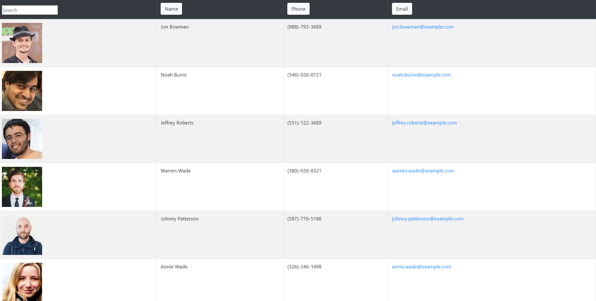

# employee-directory
Garrett Reichman
https://greichman.github.io/employee-directory/

## Description
 This site was made to begin learning React. It uses custom components for the table of employees as well as each employee row. When loaded, the site requests a list of 20 random employees from the randomuser api, parses their data, and displays them all to the page. It then tracks the total list of employees as well as the list of currently displayed employees to manage searching/sorting.
## Usage
 To use this app, start by visiting the site linked above. When the page finishes loading, it will display a list of 20 employees. If you wish to sort the list, click either the name, the phone, or the email button at the top (click twice for reverse order). You can also search for an employee using the search bar in the top left.

